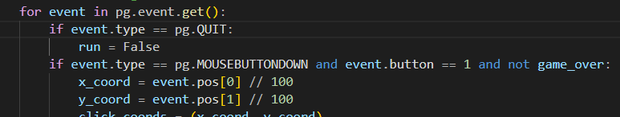

# 1) a Readme file to explain a chees code 
 
 -the chess game is based on Two player mode
 -it is created by using pygame

# 2) Functions used in this code 

#### -draw_board Function

*this function is called to draw:*
              -the grid shapes  of the chess game.
              - an empty box to type  instructions text during the game.
              - and anoter empty box at the right  to draw the deceased pieces.

### -draw pieces Function

*the main job of this function is :*
 - to draw and put the pieces at the right postion of the game grid like this :

 

 ### -check options Function

   this function it take the a list of the game pieces and all locations and the turn which refer to which  player turn ant then it reurn a list of all moves that any piece could take  

 

###  - a pieces moves option Function

it is like  check_pawn(position, color) , check_rook(position, color) ,check_king(position, color) and so on.
 
 the check_pawn Function it detemine the intial move of the pawn like Two forward step and it also determine the diagonals moves during the game 

 

### check valid moves Function

this function main objective is to estimate the vaild move of the selected piece 

 

 
 ### draw valid Function 

 this function draw the valid moves of the selected piece 

  

### draw captured pieces Function 

this function is draw the captured pieces in the empty box at the right 

  
  

### draw check Function 

this function is draw a flashing square around the king if in the check

  
 
  

### draw game over Function 

this Function print who is the winner 

 

# 3) MAIN LOOP

###at our main loop there is an event handlig 
-

-like handle  if the user click the close button of the game console window
-and if the user clicked the mouse left button then it convert the where the user clicked to a point (x,y)

### handling the Give up button

if the White pushed the Give up button 

if the Black pushed the Give up button 

